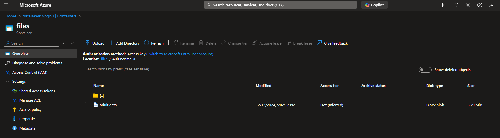
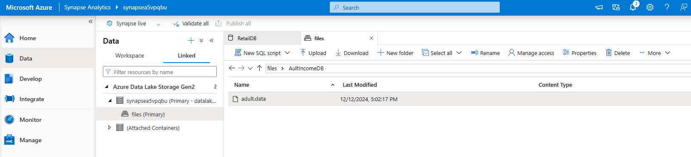
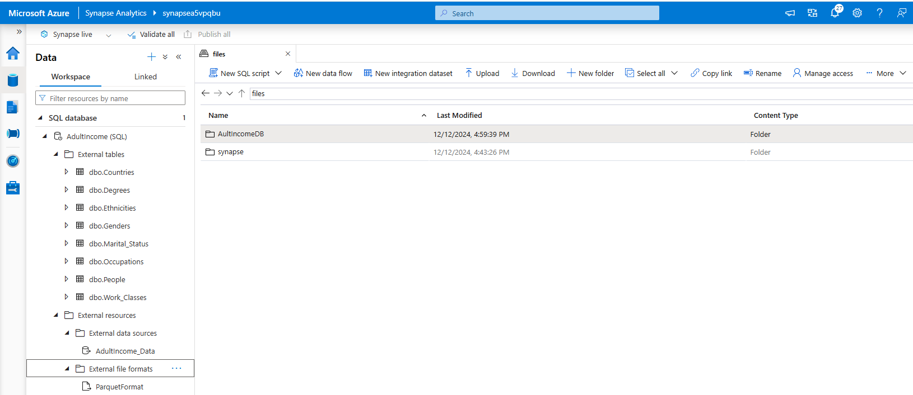
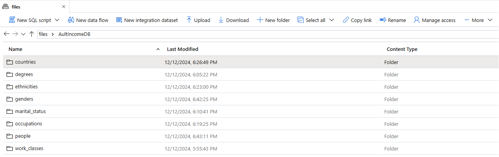
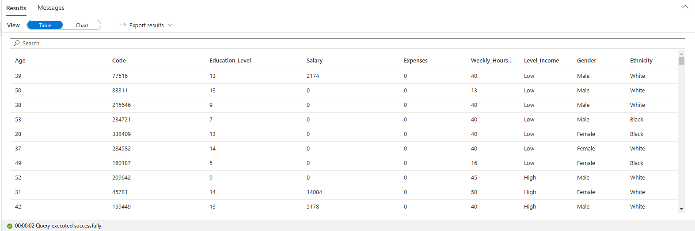

# Adult income

## Overview

The data comes from the UC Irvine Machine Learning Repository and it is structured, with predictable features and target variable defined.

Structure of the data:

* **Features**:
  * age (Numeric)
  * workclass (Categorical)
  * fnlwgt (Numeric)
  * education (Categorical)
  * education-num (Numeric)
  * marital-status (Categorical)
  * occupation (Categorical)
  * relationship (Categorical)
  * race (Categorical)
  * sex (Categorical)
  * capital-gain (Numeric)
  * capital-loss (Numeric)
  * hours-per-week (Numeric)
  * native-country (Categorical)
* **Target variable**:
  * income (Categorical): >50K or <=50K.

Link: <https://www.kaggle.com/datasets/wenruliu/adult-income-dataset>

Upload file to blob storage





```SQL
SELECT TOP 100 *
FROM
OPENROWSET(
    BULK 'https://datalakea5vpqbu.dfs.core.windows.net/files/AultIncomeDB/*',
    FORMAT = 'CSV',
    PARSER_VERSION='2.0'
) AS [result]
GO

```

## Create SQL database schema

```SQL
-- Create database schema
CREATE DATABASE AdultIncome
    COLLATE Latin1_General_100_BIN2_UTF8;
GO;

-- Activate AdultIncome database
Use AdultIncome;
GO;

-- Create data source
CREATE EXTERNAL DATA SOURCE AdultIncome_Data WITH (
    LOCATION = 'https://datalakea5vpqbu.dfs.core.windows.net/files/'
);
GO;

-- Create format for table files
CREATE EXTERNAL FILE FORMAT ParquetFormat
    WITH (
            FORMAT_TYPE = PARQUET,
            DATA_COMPRESSION = 'org.apache.hadoop.io.compress.SnappyCodec'
        );
GO;
```



## Create tables schema

```SQL
CREATE EXTERNAL TABLE People
WITH (
    LOCATION = 'AultIncomeDB/people/',
    DATA_SOURCE = AdultIncome_Data,
    FILE_FORMAT = ParquetFormat
)
AS
SELECT
    C1 AS Age,
    C3 AS Code,
    C5 AS Education_Level,
    C11 AS Salary,
    C12 AS Expenses,
    C13 AS Weekly_Hours_Work,
    IIF(TRIM(C15) = '<=50K', 'Low', 'High') AS Level_Income,
    IIF(TRIM(C9) = 'Amer-Indian-Eskimo', 1, 
            IIF(TRIM(C9) = 'Asian-Pac-Islander', 2, 
                IIF(TRIM(C9) = 'Black', 3,
                    IIF(TRIM(C9) = 'Other', 4,
                        IIF(TRIM(C9) = 'White', 5, 6)
                        )
                    )
                )
        ) AS Id_Ethnicity,
    IIF(TRIM(C10) = 'Female', 1, IIF(TRIM(C10) = 'Male', 2, 3)) AS Id_Gender
FROM
    OPENROWSET(
        BULK 'AultIncomeDB/*',
        DATA_SOURCE = 'AdultIncome_Data',
        FORMAT = 'CSV',
        PARSER_VERSION = '2.0'
    ) AS result;
GO
```

```SQL
CREATE EXTERNAL TABLE Work_Classes
WITH (
    LOCATION = 'AultIncomeDB/work_classes/',
    DATA_SOURCE = AdultIncome_Data,
    FILE_FORMAT = ParquetFormat
)
AS
SELECT
    ROW_NUMBER() OVER(ORDER BY Name) AS Id,
    Name
FROM (
    SELECT DISTINCT TRIM(C2) AS Name
    FROM
        OPENROWSET(
            BULK 'AultIncomeDB/*',
            DATA_SOURCE = 'AdultIncome_Data',
            FORMAT = 'CSV',
            PARSER_VERSION = '2.0'
        ) AS result
    WHERE TRIM(C2) <> '?'
) AS result2;
GO
```

```SQL
CREATE EXTERNAL TABLE Degrees
WITH (
    LOCATION = 'AultIncomeDB/degrees/',
    DATA_SOURCE = AdultIncome_Data,
    FILE_FORMAT = ParquetFormat
)
AS
SELECT
    ROW_NUMBER() OVER(ORDER BY Name) AS Id,
    Name
FROM (
    SELECT DISTINCT TRIM(C4) AS Name
    FROM
        OPENROWSET(
            BULK 'AultIncomeDB/*',
            DATA_SOURCE = 'AdultIncome_Data',
            FORMAT = 'CSV',
            PARSER_VERSION = '2.0'
        ) AS result
) AS result2;
GO
```

```SQL
CREATE EXTERNAL TABLE Marital_Status
WITH (
    LOCATION = 'AultIncomeDB/marital_status/',
    DATA_SOURCE = AdultIncome_Data,
    FILE_FORMAT = ParquetFormat
)
AS
SELECT
    ROW_NUMBER() OVER(ORDER BY Name) AS Id,
    Name
FROM (
    SELECT DISTINCT TRIM(C6) AS Name
    FROM
        OPENROWSET(
            BULK 'AultIncomeDB/*',
            DATA_SOURCE = 'AdultIncome_Data',
            FORMAT = 'CSV',
            PARSER_VERSION = '2.0'
        ) AS result
) AS result2;
GO
```

```SQL
CREATE EXTERNAL TABLE Occupations
WITH (
    LOCATION = 'AultIncomeDB/occupations/',
    DATA_SOURCE = AdultIncome_Data,
    FILE_FORMAT = ParquetFormat
)
AS
SELECT
    ROW_NUMBER() OVER(ORDER BY Name) AS Id,
    Name
FROM (
    SELECT DISTINCT TRIM(C7) AS Name
    FROM
        OPENROWSET(
            BULK 'AultIncomeDB/*',
            DATA_SOURCE = 'AdultIncome_Data',
            FORMAT = 'CSV',
            PARSER_VERSION = '2.0'
        ) AS result
    WHERE TRIM(C7) <> '?'
) AS result2;
GO
```

```SQL
CREATE EXTERNAL TABLE Ethnicities
WITH (
    LOCATION = 'AultIncomeDB/ethnicities/',
    DATA_SOURCE = AdultIncome_Data,
    FILE_FORMAT = ParquetFormat
)
AS
SELECT
    ROW_NUMBER() OVER(ORDER BY Name) AS Id,
    Name
FROM (
    SELECT DISTINCT TRIM(C9) AS Name
    FROM
        OPENROWSET(
            BULK 'AultIncomeDB/*',
            DATA_SOURCE = 'AdultIncome_Data',
            FORMAT = 'CSV',
            PARSER_VERSION = '2.0'
        ) AS result
) AS result2;
GO
```

```SQL
CREATE EXTERNAL TABLE Genders
WITH (
    LOCATION = 'AultIncomeDB/genders/',
    DATA_SOURCE = AdultIncome_Data,
    FILE_FORMAT = ParquetFormat
)
AS
SELECT
    ROW_NUMBER() OVER(ORDER BY Name) AS Id,
    Name
FROM (
    SELECT DISTINCT TRIM(C10) AS Name
    FROM
        OPENROWSET(
            BULK 'AultIncomeDB/*',
            DATA_SOURCE = 'AdultIncome_Data',
            FORMAT = 'CSV',
            PARSER_VERSION = '2.0'
        ) AS result
) AS result2;
GO
```

```SQL
CREATE EXTERNAL TABLE Countries
WITH (
    LOCATION = 'AultIncomeDB/countries/',
    DATA_SOURCE = AdultIncome_Data,
    FILE_FORMAT = ParquetFormat
)
AS
SELECT
    ROW_NUMBER() OVER(ORDER BY Name) AS Id,
    Name
FROM (
    SELECT DISTINCT TRIM(C14) AS Name
    FROM
        OPENROWSET(
            BULK 'AultIncomeDB/*',
            DATA_SOURCE = 'AdultIncome_Data',
            FORMAT = 'CSV',
            PARSER_VERSION = '2.0'
        ) AS result
    WHERE TRIM(C14) <> '?'
) AS result2;
GO
```



## Query data

```SQL
CREATE PROCEDURE usp_GetPeopleInformation
AS
BEGIN
    SELECT
        p.Age,
        p.Code,
        p.Education_Level,
        p.Salary,
        p.Expenses,
        p.Weekly_Hours_Work,
        p.Level_Income,
        g.Name AS Gender,
        e.Name AS Ethnicity
    FROM People p
    JOIN Genders g ON g.Id = p.Id_Gender
    JOIN Ethnicities e ON e.Id = p.Id_Ethnicity;
END
GO;

EXEC usp_GetPeopleInformation;
```


